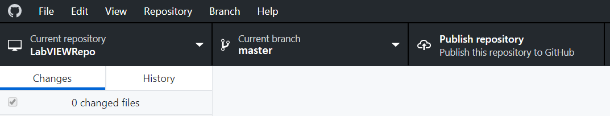
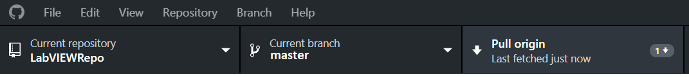
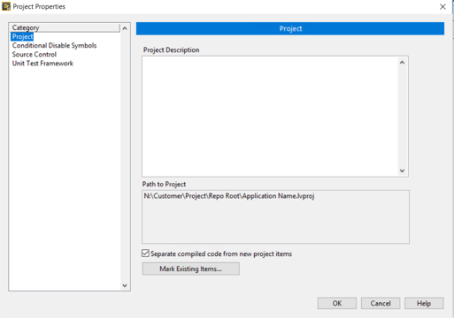

# Basic Concepts
<!-- The TOC is auto-generated using https://github.com/naokazuterada/MarkdownTOC -->
<!-- MarkdownTOC autolink="true" -->

- [Before You begin](#before-you-begin)
    - [Create a GitHub Account](#create-a-github-account)
    - [Download GitHub Desktop](#download-github-desktop)
- [Initialize a new Repository](#initialize-a-new-repository)
- [Adding a File to the Repo \(Initial Commit\)](#adding-a-file-to-the-repo-initial-commit)
- [Committing Changes](#committing-changes)
- [History](#history)
- [Publishing Your Repository to GitHub.com](#publishing-your-repository-to-githubcom)
- [Fetching and Pulling](#fetching-and-pulling)
- [Pushing](#pushing)
- [Branches](#branches)
- [Merging Branches and Pull Requests](#merging-branches-and-pull-requests)
- [Using LabVIEW and Git](#using-labview-and-git)
    - [Separating Compiled Code from VIs](#separating-compiled-code-from-vis)
    - [Avoid Merging](#avoid-merging)
- [Additional Resources](#additional-resources)

<!-- /MarkdownTOC -->

## Before You begin
### Create a GitHub Account
If you don't already have a GitHub account, go to https://github.com and create a new account. You should only use one account for all of your projects. GitHub has other mechanisms for separating personal projects from work projects.
### Download GitHub Desktop
Go to https://desktop.github.com/ and download the appropriate version for your OS.

## Initialize a new Repository
To begin, we will create a new repository on our GitHub account.
1. From the splash screen or the **File** menu, select **New Repository**

2. Fill out the fields for the new repository to be created.
	
	1. Give your new repository a name. Valid Git repository names don't have spaces, so if you attempt to give it a name with spaces it will change those spaces to dashes, e.g. "GitHub Tutorial" will be changed to "GitHub-Tutorial".
	
	2. Give your new repository a meaningful description.
	
	3. Choose a local directory for your new repository.
	
	4. Most software projects require documentation, and the easiest place to do that in GitHub is in the "README.md" file. If you want to create this file when you create repository, check the box.
	
	5. Select **LabVIEW** in the **Git Ignore** dropdown. The Git ignore file tells a repository what files it should not track. For LabVIEW, we probably don't want to track imported libaries, shared objects, executables, or metadata. These files can be identified as files to ignore using their file extensions in the Git ignore file. We could manually create this file later from scratch, but GitHub already provides a nice template for LabVIEW that includes all of the relevant file types to exclude. 
	
	6. **You MUST provide a license for your code.** If you intend to share this code, you should select MIT License or Apache License 2.0. If you don't select a license, then your code is considered unlicensed and get you and your organization in legal hot water. **ALWAYS PROVIDE A LICENSE**.
	
	7. Select **Create Repository**.
	
	8. Navigate to the local folder on your computer and observe the files that were created. The shortcut for this from GitHub Desktop is **Repository >> Show in Explorer (CTRL+SHIFT+F)**.

	9. Confirm that repository is set to not track the LabVIEW-associated files mentioned in step 5. Go to **Repository >> Repository Settings >> Ignored Files**. This is displaying the contents of the .gitignore file and should contain the following:

```
# Libraries
*.lvlibp
*.llb

# Shared objects (inc. Windows DLLs)
*.dll
*.so
*.so.*
*.dylib

# Executables
*.exe

# Metadata
*.aliases
*.lvlps
```

## Adding a File to the Repo (Initial Commit)
Create a new file and commit it.
1. Create a new simple LabVIEW VI in your local repository folder called "Hello World.vi".


2. In Github Desktop, see in the Changes tab that the new file has been detected, but not yet committed. The green plus indicates that the file is new to the repo.


3. To commit the file to the repo:

	1. A summary is required. Example: Add Hello World.vi
	
	2. The description, which is optional, can be used to add more details about the commit. Example: New VI that shows a message with a one-button dialog.
	
	3. Click **Commit to master** to complete the commit.
	
    
	
	

## Committing Changes
A commit is change to a file or set of files, it can be thought of as a revision.
1. Make a change to the Hello World LabVIEW VI you created in 1.3. For example, change the string constant to a string control and connect the string control to the connector pane.


2. GitHub Desktop will automatically detect the changes made in the LabVIEW VI. These changes will be staged in the **Changes** tab. The yellow dot icon indicates that changes have been made to the file.


3. Create another new LabVIEW VI, "Simple Add.vi". From GitHub Desktop staged changes, you will be able to see that the new file is also automatically detected and will show up with a green plus icon to indicate that it is a new file.

4. Commit the changes. Multiple changes can be committed together or separately. Use the checkboxes beside each staged difference in the Changes tab to select which changes you would like to commit.

	1. Commit **only** the change to "Hello World.vi" by unchecking the checkbox next to the "Simple Add.vi". Add summary and description and click **Commit to master**.
	
    
	

	
	2. Commit the remaining change, which adds "Simple Add.vi" to the repo.
	
    
	
	

## History
We can view information on past commits from GitHub Desktop.
1. Click the **History** tab in GitHub Desktop and click on a commit to get more details about it.


1. Commit summary.
2. Commit description.
3. A unique ID is created for every commit. This is sometimes called the SHA or the hash.

Right-clicking on an item in the **History** tab gives you the option to revert the commit. This should be used with caustion, as it undoes all changes since the previous commit, reverting your files back to a previous version. This option is also available via right-click from changes staged in the **Changes** tab.

## Publishing Your Repository to GitHub.com
You have already heard of GitHub.com, where you created your GitHub account. Up until this point, what we have been doing is using the version control software Git to track changes on our computer. This makes our computer into a Git server. The files still only exist in one place: On our machine.

GitHub.com is a web-based hosting service that we can push repositories to. This explores additional benefits of using Git besides change tracking, such as:
* Create backups of our work.
* Coordinate multiple users working on one project.

1. Click **Publish repository** to publish your repository to GitHub.com. GitHub desktop offers the option to keep your code private, but uncheck this, as private repos are only available to paying users on GitHub.com. Your repo will be viewable to the public after it is uploaded to the GitHub.com servers.





Now, a copy of your repository (your project folder) has been "pushed" to the GitHub servers and is accessible to the public via GitHub.com. Go to your GitHub page online and observe the files that were created. A shortcut from GitHub Desktop to view the repo online in a browser is **Repository >> View on GitHub (CTRL+SHIFT+G)**. Now that it is hosted on GitHub.com, additional changes can be pushed from you as well as other users of GitHub. We will next cover how to manage access and conflicting changes.

## Fetching and Pulling
Notice the top bar now says **Fetch origin** with a time. Fetching means detecting the latest changes from an online repo, but it does not automatically merge these changes into the local repo. With the "last fetched" time, GitHub Desktop is indicating to us the time that it last connected with the GitHub.com repository. When it detects changes, it will give you the option to pull. Pulling (**Repository >> Pull**) will take changes from the remote online repo and apply them to your local repo files.

If you are working on a project with multiple users making changes, you can see how it is very crucial that you pull from the main repository that everyone is working from before starting your own changes (e.g. adding a feature or fixing a bug). Otherwise, you may not be working with the most up-to-date version of the project. We will illustrate this by making a change in the repository hosted on GitHub.com and seeing how pulling looks in the GitHub Desktop application on your computer following these changes.

1. Launch your repository page on GitHub.com in a browser. You can either navigate to this from GitHub.com, or from GitHub Desktop, use **Repository >> View on GitHub** (CTRL+SHIFT+G).

2. We will edit the "README.md" file. GitHub.com provides a built-in text editing tool. This simulates a change to the repo that may have been pushed by another user. Click on "README.md" and then click the pencil icon on the right that launches the GitHub.com text editor. The file extension ".md" stands for Markdown, a lightweight markup language.


3. Add text to the "README.md" file and commit your changes with the box below the editor. Note that we are still working in the branch **master**.

4. Go back to GitHub Desktop. You will see that the button that previously said **Fetch origin** now says **Pull origin**. Click this to apply the change to your local repo.





5. Navigate to the "README.md" file on your computer and open it. You will see that the changes you made in GitHub.com are now reflected in this copy of the file as well. You can also see from the **History** tab that the revision has been added to the list of commits for the branch.

## Pushing
Up until this point we have explored how to pull the most up-to-date version of the remote repo onto your computer. The next step is to make a change to your local repo and push it back to the remote repo.

1. Open "README.md" in your local repo. Add text to the file and save the changes.

2. From GitHub Desktop, commit the changes.

3. Use the **Push origin** button to push changes to the remote repo.

4. Open the repo hosted on GitHub.com (CTRL+SHIFT+G) and see that the changes you made are reflected in the "README.md" file there.

Allowing multiple users to push to a single remote repo in this manner will very quickly start to get messy. It creates the possibility of overwriting someone else's changes. Next, we introduce branches and pull requests as methods to control access to a repo and organize changes made by multiple users working on one repo.

## Branches
Creating a branch creates a parallel version of the **master** (primary or default) branch. Making changes in this new branch will not disrupt the master branch, and the changes made in the new branch can be merged back into the master branch when the developer is ready.
1. Create a new branch from GitHub Desktop with **Branch >> New branch** (CTRL+SHIFT+N). It will ask for a name, call it "Third-Sum-Edit". This will be the branch in which we add a new feature: Add a third number to the summation in Simple Add.vi.


2. Add a third number to the calculation in LabVIEW VI Simple Add.vi.


3. Commit the changes to the branch.
	1. Check that you are in the correct branch from the top menu that reads "**Current branch**. It is very important that we commit to the correct branch, as committing to the **master** branch will edit the primary copy, and that may affect the other users accessing it.
	2. Add a summary and description for the commit.
	
    
	
	

	3. Notice that the commit button now reads **Commit to Third-Sum-Edit**, instead of **Commit to master**. Commit to the branch.

4. From the **Current Branch** menu on the top bar, switch back to **master** branch and view the **History** tab. There, you can confirm that these changes we committed to the branch are not reflected in the **master** branch. Be sure to switch back to **Third-Sum-Edit** branch before continuing, as we want to keep working in this branch. Note that we can only switch branches when all changes have been committed (no changes are staged).

5. Publish branch to GitHub.com with the **Publish branch** button. Then, go to the online repo and you will be able to see from Code >> 2 branches that your new branch is now present in this repo as well. However, it is still separate from the master branch. You will have to merge the Third-Sum-Edit branch with the master branch for the changes to be reflected there.

## Merging Branches and Pull Requests
If we are the owners of the repo, we can merge our new branch directly with the **master** branch without additional review. This would be done with the following procedure:

1. Navigate to the **master** branch. Note that it is very important that you do this from the **master** branch, so that the **master** remains the primary/default branch.

2. Use **Branch >> Merge into current branch** (CTRL+SHIFT+M).

3. Select **Third-Sum-Edit** branch, which merges the changes made in the branch back into the **master** branch.

However, if multiple users have multiple branches, merging them all without a gatekeeping review process could result in issues, such as unwanted changes or overwriting someone else's work. We therefore want to create a pull request, which requests a merge with the master branch, and the merge will not be completed without approval from one of the repo's approvers.

1. Confirm from **Current branch** in the top bar in GitHub Desktop that you are currently in the branch you want to create the pull request for, in this case, **Third-Sum-Edit**.

2. Go to **Branch >> Create pull request** (CTRL+R). This launches the pull request page in GitHub.com. Note that the branch must be pushed before a pull request can be made, so that all changes you've made on the branch locally are also reflected in the GitHub.com copy of the branch. In this case, we have not made changes since publishing the branch to GitHub.com, so we do not need to push.

3. The **Open a pull request** page should show that you are requesting a merge of **Third-Sum-Edit** into **master**. This means the **base:** is **master** and the **compare:** is **Third-Sum-Edit**.


4. Select **Create pull request**. See that this creates a forum where reviewer comments can be added. You can continue working and committing more changes to the pull request until it is approved by an approver, the pull request will update to reflect these additional commits as long as you continue to push them.

5. In this case, we are owners of the repo, so we have reviewer privileges. Therefore, we are able to **Merge the pull request** on our own, and you can go ahead and do so. If you did not have reviewer privileges, the option would be disabled, as shown below.


6. Once you have merged the changes from **Third-Sum-Edit** into **master**, you can navigate to the **branches** tab and delete **Third-Sum-Edit**. A branch should be tied to a specific feature addition, bug fix, etc. Once this has been completed, it should be deleted and new branch started for the next section of work.

Congratulations! You now know the basics of using Git source control with GitHub.com and GitHub Desktop.

## Using LabVIEW and Git
There are a few things to be aware of when using LabVIEW with Git.

### Separating Compiled Code from VIs

By default, a VI stores two types of code together:
* Graphical source code that you edit in the LabVIEW development environment
* Compiled code that LabVIEW uses to run the VI

When you make changes to a VI in the development environment, LabVIEW automatically recompiles the code to reflect the changes you have made, and does the same for all calling VIs as well.

This becomes a problem if you make changes to a subVI when using source control. Since all calling VIs will also be recompiled, Git will detect changes in the binary code of those files. These will be reflected as uncommitted changes, even when you haven't actually made LabVIEW code changes to the calling VIs.

Fortunately, there is a way to separate compiled code from the source code of a VI.

**Project Properties >> Project >> Separate compiled code from new project items**. Use **Mark Existing Items** to select which existing items you would like to have separated compiled code.





When you check this option, LabVIEW will store the compiled code separately, in a compiled object cache on your local machine, rather than in the VI file that is in the repository. This enables Git to accurately detect which VIs have had code changes made to them.

This option should not be used when you are intending to run or load the VI with the LabVIEW Run-Time Engine. The Run-Time Engine cannot handle source-only VIs because it has no access to the compiled object cache.

Keep in mind that it is always recommended to deliver source code with an export and not by copying project folders. Read [Best Practices for Code Packaging in LabVIEW](ftp://ftp.ni.com/pub/branches/us/Dev%20Days/best_practices_code_packaging_labview.pdf) for more information.

Resources:

* [Facilitating Source Control by Separating Compiled Code from VIs and Other File Types](http://zone.ni.com/reference/en-XX/help/371361R-01/lvconcepts/saving_vis_compiled_code/)
* [Separating Compiled Code from VIs and Other File Types](http://zone.ni.com/reference/en-XX/help/371361P-01/lvhowto/separate_compiled_code/)
* [Best Practices for Code Packaging in LabVIEW](ftp://ftp.ni.com/pub/branches/us/Dev%20Days/best_practices_code_packaging_labview.pdf)

### Avoid Merging

We have discussed merging a branch into the master branch, but what about merging changes to one file when two users have simultaneously made changes?

While troublesome, there are tools to compare these sorts of conflicting changes in text-based coding. With graphical coding, this kind of file merge will present a larger challenge.


Merge "battles" should therefore be prevented whenever possible by avoiding simultaneous conflicting changes to the same file by multiple users. There are a few methods to prevent this.

1. Code Organization

By splitting code into different files, simultaneous development on one file can be more easily avoided. Use subVIs to separate code.

Bad:


Good:


See that in the "good" example, the code is separated in subVIs by function:
* Application control, handles unexpected errors
* Receive remote commands with network streams
* Data acquisition engine
* Analyze data and check trig conditions
* Write TDMS files to disk, manage hard drive
* Periodically broadcast system health
* Send tags and wfms to remote client
* Check for hanging threads

Since these subVIs are in different files, they can be worked on simultaneously, and all users would still be working on improvements to the overall application.

2. Communication

Communicate to project members to understand who is assigned each change that must be made. Accidentally making changes to the same file due to miscommunication will result in a merge battle. There are some tools to better organize your team.

Use GitHub Issues to track and assign changes. Go to your repository page on GitHub.com. From the Issues tab, you can create and assign specific issues to members of the team.

It is best practice to tag in your commits the issue(s) that it addresses. GitHub Desktop will allow you to tag issues directly from either the **Subject** or **Description** of your commit.

Once the issue has been created in GitHub.com, ensure that your local repo is synced with the online repo (recall that this is done with **Fetch Origin**). Then, you will be able to tag the issue by typing #. This will bring up a list of the issues. Click on the relevant issue to insert the tag.


An additional tool that can be used is LabVIEW bookmarks.

Bookmarks are created by the # tag in a free label, object label, wire label, or subdiagram label. Below, the tag "#NOTE: Report, put don't pass error. Run every command."" has been created.


All bookmarks can be viewed in the Bookmark Manager. This can even be launched from a project, which displays bookmarks in all VIs in the project.
**View >> Bookmark Manager**


Come up with a system to help other team members easily identify fixes that must be made within existing LabVIEW code. In the above system, these tags are used for the following functions:
* **#BUG** denotes where an issue may be referring to
* **#NOTE** are notes about the program that may be helpful to other developers
* **#TODO** denotes where additional code should be added in the future

Resources
* [Bookmark Manager](http://zone.ni.com/reference/en-XX/help/371361K-01/lvdialog/bkmk_manager_moreinfo/)
* [5 Things You Need to Know About LabVIEW Bookmarks](https://forums.ni.com/t5/LabVIEW-News/5-Things-You-Need-to-Know-About-LabVIEW-Bookmarks/ba-p/3486903)

## Additional Resources
* [GitHub Glossary](https://help.github.com/articles/github-glossary/)
